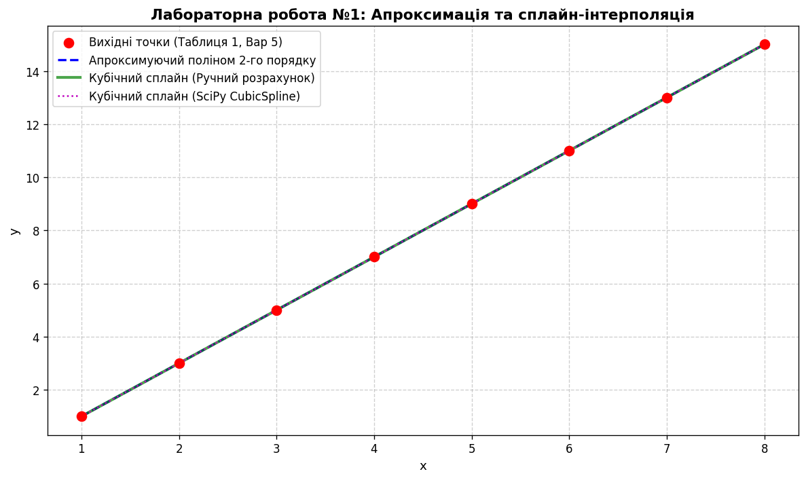

# Лабораторна робота №1
**Тема:** Апроксимація та інтерполяція функцій  
**Дисципліна:** Основи цифрової обробки сигналів  
**Студент:** Варіант 5  

---

## 1. Мета роботи
Вивчити методи апроксимації та інтерполяції даних. Навчитися здійснювати обчислення наближень сигналів на основі їх інтерполяції кубічними сплайнами та апроксимації методом найменших квадратів (МНК). Отримати навички обробки даних у середовищі Python (NumPy, SciPy).

---

## 2. Повний текст завдання (Варіант 5)
1. Для наведених у таблиці значень пар вимірювань $x_n, y_n$ провести згладжуючий апроксимуючий поліном $P(x) = a + bx + cx^2$ згідно аналітичних виразів МНК та з використанням бібліотечної функції `np.polyfit`. Провести порівняння отриманих результатів.
2. Знайти звичайний кубічний сплайн для пар ($N = 8$) величин згідно аналітичних формул та за допомогою бібліотечної функції `scipy.interpolate.CubicSpline` з природними граничними умовами ($y''_1 = 0, y''_N = 0$). Провести порівняння.
3. Побудувати графіки експериментальних точок, апроксимуючого полінома та сплайну.

**Вхідні дані:**
* $x_n = [1,\, 2,\, 3,\, 4,\, 5,\, 6,\, 7,\, 8]$
* $y_n = [1,\, 3,\, 5,\, 7,\, 9,\, 11,\, 13,\, 15]$

---

## 3. Теоретичні розрахунки та лістинг

### 3.1. Апроксимація поліномом 2-го порядку (МНК)
Система нормальних рівнянь Гауса:
$$\begin{pmatrix} N & \sum x_n & \sum x_n^2 \\ \sum x_n & \sum x_n^2 & \sum x_n^3 \\ \sum x_n^2 & \sum x_n^3 & \sum x_n^4 \end{pmatrix} \begin{pmatrix} a \\ b \\ c \end{pmatrix} = \begin{pmatrix} \sum y_n \\ \sum x_n y_n \\ \sum x_n^2 y_n \end{pmatrix}$$

Для набору точок варіанту 5 залежність є лінійною ($y_n = 2x_n - 1$).  
Отримані коефіцієнти:
* **Ручний розрахунок:** $a = -1.0000$, $b = 2.0000$, $c = 0.0000$
* **`np.polyfit`:** $a = -1.0000$, $b = 2.0000$, $c = 0.0000$
* **Рівняння полінома:** $P(x) = -1 + 2x$ (коефіцієнт $c = 0$, парабола виродилась у пряму).

### 3.2. Кубічна сплайн-інтерполяція
Для внутрішніх вузлів розв'язується тридіагональна система відносно других похідних $y''_n$:
$$h_{n-1}y_{n-1}'' + 2(h_{n-1} + h_n)y_n'' + h_n y_{n+1}'' = - \frac{6}{h_{n-1}}(y_n - y_{n-1}) + \frac{6}{h_n}(y_{n+1} - y_n)$$

З огляду на лінійність вхідних даних ($y_n = 2x_n - 1$), праві частини системи для всіх внутрішніх точок тотожно рівні нулю:
$$-6(2) + 6(2) = 0$$
Отже, вектор других похідних $y'' = [0, 0, 0, 0, 0, 0, 0, 0]^T$.

Коефіцієнти сплайна $P_n(x) = a_n + b_n(x - x_n) + c_n(x - x_n)^2 + d_n(x - x_n)^3$ на кожному кроці $h_n = 1$:
* $a_n = y_n$
* $b_n = 2.00$
* $c_n = 0.00$
* $d_n = 0.00$

Результат аналітичного розрахунку повністю тотожний `scipy.interpolate.CubicSpline(x, y, bc_type='natural')`.

---

## 4. Графік результатів

*Поліном 2-го порядку, аналітичний кубічний сплайн і бібліотечний сплайн ідеально накладаються на експериментальні точки.*

---

## 5. Відповіді на контрольні запитання (стисло)
1. **Який метод наближення є найбільш вживаним?**  
   Метод найменших квадратів Гауса ($L_2$-апроксимація), оскільки він мінімізує дисперсію помилки наближення та зводиться до розв'язання системи лінійних алгебраїчних рівнянь.
2. **Чому здійснюють пошук поліномів не вище третього порядку?**  
   Поліноми вищих порядків схильні до коливань та пульсацій на краях інтервалу (явище Рунге), що спотворює реальну поведінку сигналу.
3. **Чим апроксимація відрізняється від інтерполяції?**  
   При інтерполяції крива обов'язково проходить через усі вузлові точки ($f(x_n) = y_n$). При апроксимації крива згладжує дані та фільтрує шум, проходячи близько до точок за критерієм мінімізації похибки ($f(x_n) \approx y_n$).
4. **Коли доцільно заміняти згладжуючі поліноми сплайнами?**  
   Коли сигнал має складну нелінійну траєкторію з багатьма локальними змінами, де один глобальний поліном невисокого степеня дає велику похибку, а високого — паразитичні коливання.

---

## 6. Висновок
Під час виконання лабораторної роботи було досліджено методи апроксимації функцій за методом найменших квадратів (поліном 2-го порядку) та інтерполяції за допомогою кубічних сплайнів. 

Для варіанту 5 вхідні точки задають строгу лінійну залежність ($y = 2x - 1$). У результаті апроксимуючий поліном отримав коефіцієнт $c = 0$, перетворившись на пряму лінію, а другі похідні сплайна на всіх ділянках виявилися рівними нулю ($c_n = 0, d_n = 0$). Отримані вручну аналітичні результати продемонстрували повну збіжність (похибка $< 10^{-14}$) із вбудованими бібліотечними функціями `np.polyfit` та `scipy.interpolate.CubicSpline`.